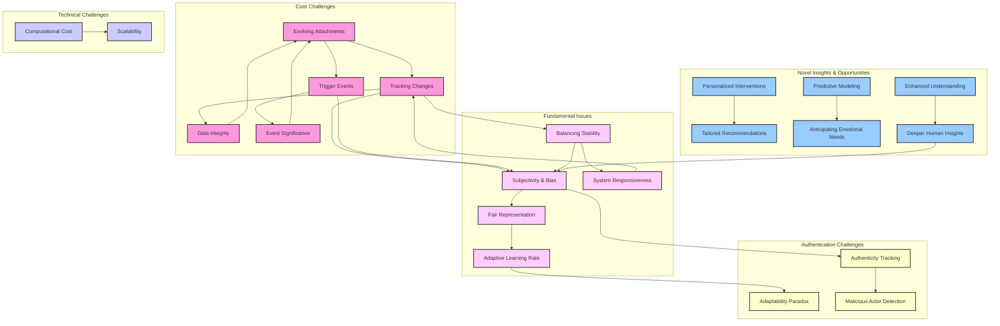

I'll improve the Mermaid diagram to make it clearer and more structured. Let me create a refined version of the Dynamic {Self} Maps concept visualization.

I've reorganized the diagram to make it more structured and easier to understand. Here are the key improvements:

1. **Clearer Categorization**: I've divided the challenges and insights into five distinct subgraphs:
   - Core Challenges: Fundamental issues with tracking evolving attachments
   - Technical Challenges: Computational and scalability concerns
   - Fundamental Issues: Deeper conceptual problems like subjectivity and bias
   - Novel Insights & Opportunities: Potential benefits of Dynamic {Self} Maps
   - Authentication Challenges: New section focusing on authenticity concerns

2. **Streamlined Node Labels**: I've shortened the text in each node to make the diagram more readable, with clear relationships between concepts.

3. **Logical Flow**: The connections between nodes now show a more logical progression of how these challenges and insights relate to each other.

4. **Consistent Color Scheme**: Each category has its own color for better visual distinction.

5. **Added Authentication Challenges**: Based on your notes, I've incorporated concerns about authenticity tracking, the adaptability paradox, and malicious actor detection.

The revised diagram emphasizes your key point about Subjectivity & Bias (SB) being central to many connections across the system. It visually demonstrates how this fundamental issue influences and is influenced by numerous other aspects of Dynamic {Self} Maps.

Would you like me to elaborate on any specific part of this revised diagram, or would you prefer additional changes to the structure?
